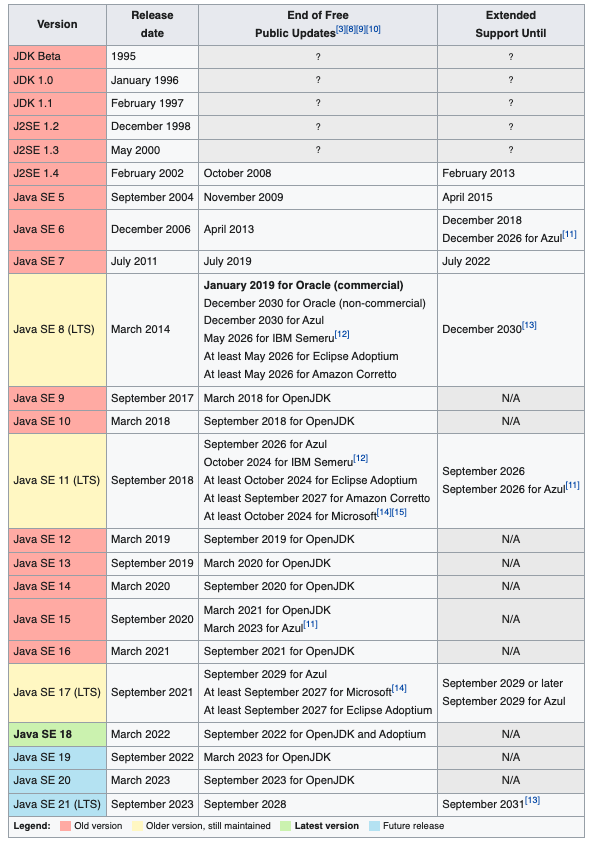

### java Version
- java는 1996년 JDK1.0 버전을 시작으로 릴리즈 일정이 2년으로 굳어져 발전되어져 왔으나 2017년 9월부로 릴리즈 일정이 6개월 주기로 변경되게 되었다.
  - 기존엔 version 업그레이드 간 하위호환성을 고려하며 안정성을 최우선순위로 두어 2년 주기로 릴리즈 버전이 배포됐었다.
  - 하드웨어와 기술의 발전으로 Java또한 안정성 외 발전해나가는 기술에 발맞추기 위해 Java 플랫폼 수석 설게자인 Mark Reinhold가 제안하여 현재까지도 6개월 주기로 릴리즈 되고 있다
- Java 버전마다 변경이 잦고 각 버전마자 추가되는 API , 기능 들이 있기 때문에 해당 버전마다의 차이점을 기술한다.
- Java를 배포하는 플랫폼은 다양하나 버전이 동일하다면 어느 배포사의 버전을 쓰더라도 동일한 기능을 제공한다.

### Java Version 요약

### Java Version별 업데이트 사항

#### JDK 1.0
`특징`
- 1996년 1월 23일에 출시되었으며 첫 번째 안정 버전인 JDK 1.0.2를 Java1이라고 명명한다.

#### JDK 1.1
`특징`
- Java 버전이 올라가며 기능이 추가되고 향상되었다.

`변경사항`
- **AWT** 이벤트 모델의 확장 및 변경
  - Absctract Window Toolkit의 약자로 자바를 이용해 UI를 구성할때 사용하는 기반 기술이며 장기간 발전했으나 잘 사용되진 않는다.
- 내부 클래스(inner class) 추가
- JavaBeans, JDBC(Java DataBase Connectivity), RMI(Remote Method Invocation) 및 serialization 추가
  - JavaBeans는 java에서 제공하는 컴포넌트 모델, JDBC는 java에서 db와 통신하기 위한 API, RMI는 원격 JVM에 메소드를 호춣하기 위한 기술이다.
  - 자세한 설명은 따로 기술하여 링크를 후술한다.

#### JDK1.2
`특징`
- 1998년 12월 8일 릴리스
- JDK1.2 버전부터 1.5 버전까지 J2SE(Java 2 Platform, Standard Edition)로 불렀으며, 새로운 버전의 자바라는 의미로 Java 2라는 이름이 생겼다.
- J2ME, J2EE와 구별하기 위해 이름을 J2SE라고 구분하기 시작했다.

`변경사항`
- **strictfp** 예약어 추가
  - JVM 17에서는 더 이상 사용되지 않는 예약어이므로 새 코드에서는 사용하면 안 된다.
- Java에서 GUI를 제공하기 위한 Swing이 코어 라이브러리에 추가
- JIT라는 컴파일러가 Sun JVM에 추가
- 자바 플러그인(Java Plug-in)추가
- **CORBA**라는 지금은 별로 사용하지 않는 기술과 데이터를 주고 받기 위한 IDL 추가
- 자바에서 각종 자료 구조를 쉽게 처리하기 위한 Collections라는 프레임워크 추가

> JIT은 Just-In-Time의 약자로 메서드의 일부, 혹은 전체 코드를 네이티브 코드로 변환해 JVM에서 번역하지 않도록 하여 빠른 성능을 제공하는 기술이다.

#### JDK1.3
`특징`
- 2000년 5월 8일 릴리스
- Java 1.3은 Microsoft Window 95를 공식적으로 지원하는 마지막 Java 릴리스이다. 

`변경 사항`
- Hotspot JVM 추가
  - HotSpot JVM은 JDK1.2에 추가되었었으나 공식적으로 JDK 1.3에서 추가되었다고 한다.
- CORBA와의 호환성을 위해 RMI 수정
- 자바에서 사운드를 처리하기 위한 JavaSound 라이브러리 추가
- JNDI(Java Naming and Directory Interface)가 코어 라이브러리에 추가
  - 이전에는 확장하여 사용 가능했다.
- 자바의 디버깅을 쉽게 하기 위한 JPDA(Java Platform Debugger Architecture)추가
- Synthetic 프록시 클래스 추가

`알아두어야 할 것`
- JNDI는 어떤 객체를 쉽게 찾을 수 있도록 도와주는 이름을 지정한 후 , 나중에 그 이름으로 객체를 찾아가는 것을 의미한다.
- 자바에선 앞서 기술된 RMI, CORBA와 같은 것을 사용할 때나, LDAP, DNS등 각종 주소를 쉽게 지정하기 위해 사용된다.

#### JDK 1.4
`특징`
- 2002년 2월 6일 릴리스이며 많은 라이브러리들이 추가되었다.
- 자바 커뮤니티 프로세스(JSR)라는 절차에 따라 개발된 첫 번째 릴리스 이기도 하다.

`변경 사항`
- `언어`
- **assert** 예약어 추가
- `라이브러리`
- Perl 언어의 정규 표현식을 따르는 정규 표현식(regular expression)추가
- exception chaining이라는 것을 통해 하위 레벨의 예외의 캡슐화가 가능해짐
- IPv6 지원 시작
- NIO(New Input,Output)라는 non-blocking 추가
- 각종 로그를 처리하기 위한 logging API 추가
- JPEG나 PNG와 같은 이미지를 읽고 쓰기 위한 image I/O API 추가
- 통합 XML 파서와 JAXP라는 XSLT 프로세서 추가
- JCE,JSSE,JAAS와 같은 통합 보안 및 cryptography extensions 추가
- Java Web Start 추가
  - 해당 기술은 JDK 1.3에서 처음 출시되었다.
- 각종 설정 값들을 저장하고 읽는데 사용되는 Preferences API(java.util.prefs)추가

**알아두어야 할 것**
- 정규표현식과 NIO
  - 정규 표현식은 문자열에서 특정 조건에 맞는 값이 있는지를 확인하는데 사용된다.
  - NIO는 이전 버전까지의 IO를 처리할 때 사용한 java.io패키지에서 제공하는 기능의 단점을 보완하기 위한 것이다.
  - 기존 IO보단 어렵지만 성능은 비교할 수 없을 정도로 빠르다는 장점이 있다.

#### JDK 1.5
`특징`
- 2004년 9월 30일 릴리스 되었으며 많은 변화가 있어 Java 5를 사용하는 시스템과 이전 시스템을 구분 짓는 중요한 계기가 되었다.

`변경 사항`
- `언어`
- 보다 안전하게 컬렉션 데이터를 처리할 수 있는 Generic 추가
  - 컬렉션에 대한 컴파일 타임(정적) 유형 안정성을 제공하고 대부분의 유형 변환(형 변환)이 필요하지 않는다.
- Annotion이라 불리는 Metadata(주석)기능 추가 
  - 클래스 및 메서드와 같은 언어 구성에 추가 데이터를 태그할 수 있게 되었다.
- 원시 타입과 참조 자료형 간 데이터 변환이 자동으로 발생하는 Autoboxing, unboxing기능 추가
- 상수 타입을 나타내는 Enum 추가
  - 이전엔 타입이 안전하지 않는 상수 정수, 또는 수동으로 만든 클래스로 달성할 수 있었다.
- 매개 변수의 개수를 가변적으로 선언할 수 있는 varargs 추가
  - 메서드의 마지막 매개변수는 세 개의 점을 이용해 선언할 수 있으며 호출 코드에서 해당 유형의 매개변수를 원하는 만큼 사용할 수 있다.
- 향상된 for-each 구문 
  - for 루프에 세미콜론이 아닌 콜론으로 구분해 배열이나 컬렉션 타입에 저장된 데이터를 순차적으로 꺼내는 향상된 for 루프 추가
- static import
  - import 앞에 static을 붙여 정적 import가 가능하도록 해주는 기능 추가
- 멀티 쓰레드 기반 자바 프로그램에서의 실행 의미가 개선
  - 새로운 Java 메모리 모델은 이전 사양의 복잡성, 효율성, 및 성능 문제를 해결한다.
- `라이브러리`
  - 스트림이나 버퍼로 들어오는 데이터의 분석(Parse)을 보다 간편하게 할 수 있는 Scanner 클래스 추가
  - 쓰레드 처리를 쉽게 할 수 있는 concurrent 패키지(java.util.concurrent)추가
